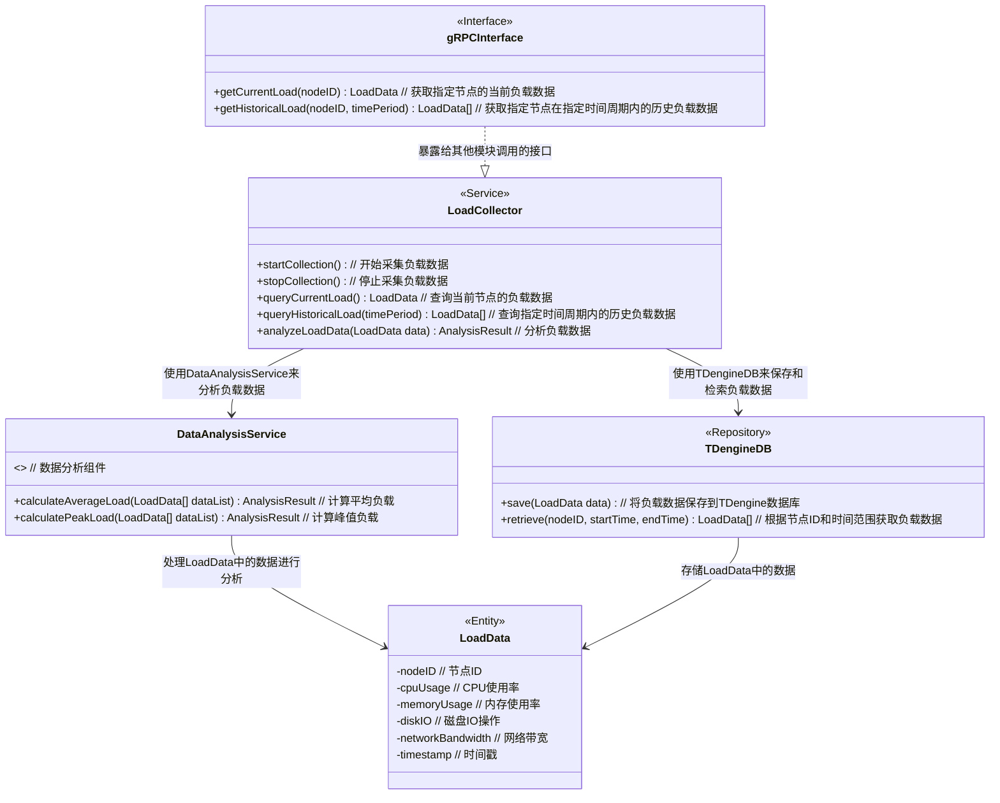

```mermaid
classDiagram
    class LoadCollector {
        <<Service>> 
        +startCollection()  // 开始采集负载数据
        +stopCollection()  // 停止采集负载数据
        +queryCurrentLoad() LoadData  // 查询当前节点的负载数据
        +queryHistoricalLoad(timePeriod) LoadData[]  // 查询指定时间周期内的历史负载数据
        +analyzeLoadData(LoadData data) AnalysisResult  // 分析负载数据
    }

    class LoadData {
        <<Entity>> 
        -nodeID  // 节点ID
        -cpuUsage  // CPU使用率
        -memoryUsage  // 内存使用率
        -diskIO  // 磁盘IO操作
        -networkBandwidth  // 网络带宽
        -timestamp  // 时间戳
    }

    class TDengineDB {
        <<Repository>>
        +save(LoadData data)  // 将负载数据保存到TDengine数据库
        +retrieve(nodeID, startTime, endTime) LoadData[]  // 根据节点ID和时间范围获取负载数据
    }

    class DataAnalysisService {
        <<Component>>  // 数据分析组件
        +calculateAverageLoad(LoadData[] dataList) AnalysisResult  // 计算平均负载
        +calculatePeakLoad(LoadData[] dataList) AnalysisResult  // 计算峰值负载
    }

    LoadCollector --> TDengineDB : 使用TDengineDB来保存和检索负载数据
    LoadCollector --> DataAnalysisService : 使用DataAnalysisService来分析负载数据
    DataAnalysisService --> LoadData : 处理LoadData中的数据进行分析
    TDengineDB --> LoadData : 存储LoadData中的数据

    class gRPCInterface {
        <<Interface>> 
        +getCurrentLoad(nodeID) LoadData  // 获取指定节点的当前负载数据
        +getHistoricalLoad(nodeID, timePeriod) LoadData[]  // 获取指定节点在指定时间周期内的历史负载数据
    }

    gRPCInterface ..|> LoadCollector : 暴露给其他模块调用的接口
```