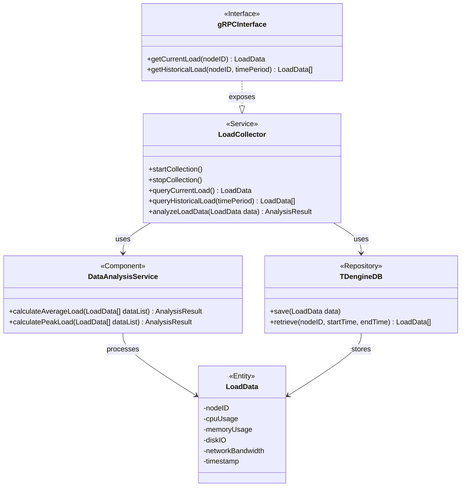

```mermaid
classDiagram
    class LoadCollector {
        <<Service>>
        +startCollection()
        +stopCollection()
        +queryCurrentLoad() LoadData
        +queryHistoricalLoad(timePeriod) LoadData[]
        +analyzeLoadData(LoadData data) AnalysisResult
    }

    class LoadData {
        <<Entity>>
        -nodeID
        -cpuUsage
        -memoryUsage
        -diskIO
        -networkBandwidth
        -timestamp
    }

    class TDengineDB {
        <<Repository>>
        +save(LoadData data)
        +retrieve(nodeID, startTime, endTime) LoadData[]
    }

    class DataAnalysisService {
        <<Component>>
        +calculateAverageLoad(LoadData[] dataList) AnalysisResult
        +calculatePeakLoad(LoadData[] dataList) AnalysisResult
    }

    LoadCollector --> TDengineDB : uses
    LoadCollector --> DataAnalysisService : uses
    DataAnalysisService --> LoadData : processes
    TDengineDB --> LoadData : stores

    class gRPCInterface {
        <<Interface>>
        +getCurrentLoad(nodeID) LoadData
        +getHistoricalLoad(nodeID, timePeriod) LoadData[]
    }

    gRPCInterface ..|> LoadCollector : exposes
```